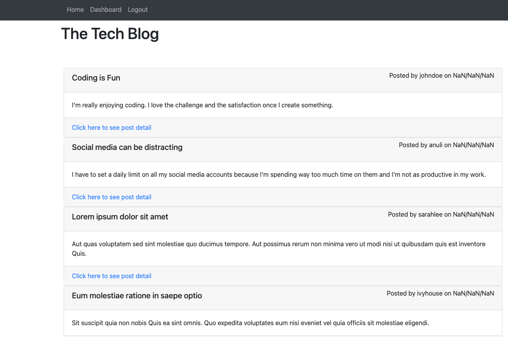
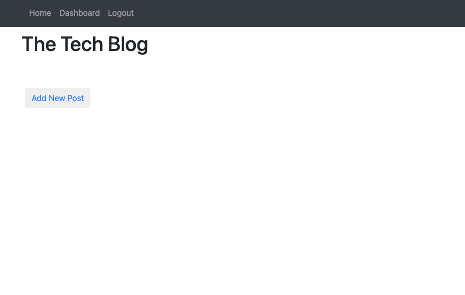

# MVC Tech Blog

## Description
  This is a CMS-style blog where developers can publich their blog posts and comment on other developers' posts as well. It follows the MVC paradigm and uses Handlebars.js as the templating language, Sequelize as the ORM, ad the express-session npm package for authentication.

## Table of Contents
  - [Installation](#installation)
  - [Usage](#usage)
  - [Credits](#credits)
  - [Features](#features)
  - [Tests](#tests)
  - [License](#license)

  ## Installation
  Clone the respository from the repo in GitHub. Make sure you install Node.js and NPM on your computer. Run `npm install` to install the required dependencies. Run `npm run seed` to seed the data then `npm start` to start the server.

  ## Usage

  Link to deployed application [here](https://new-green-gate.herokuapp.com/). 

  Start by opening the file in the terminal. Make sure you use the environment to update your MySQL username and password. Run `mysql -u root -p` to initialize MySQL, then type your password to login. Run `source db/schema.sql` to load the database and then `npm run seed` to seed data to your database. Run `npm start` to start the server.

  
  
  
 

## Credits

  

## Features
* Node.js
* Express.js
* Handlebars.js
* Bcrypt
* Express sessions
* MySQL2
* Dotenv
* Sequelize

## Tests 
N/A

## License
The project is licensed under MIT. For more information, please refer to the LICENSE in the repo.
  

